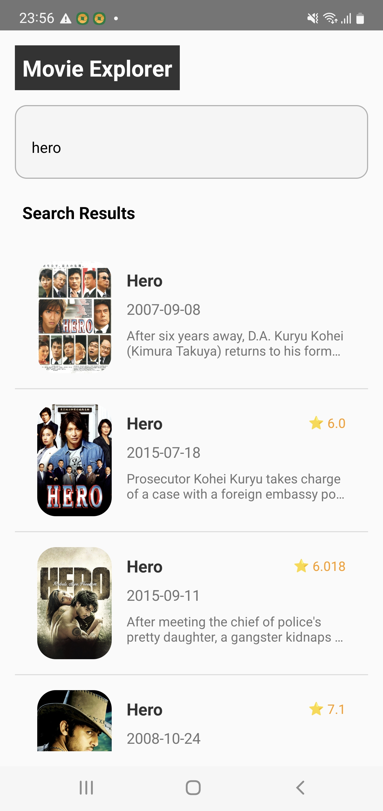

# 🎬 Movies App

A modern Android application built with Kotlin that showcases trending movies, search functionality, and detailed movie information using The Movie Database (TMDb) API.

## 📱 Features

- **🔥 Trending Movies**: Browse the latest trending movies
- **🔍 Movie Search**: Search for movies by title
- **📖 Movie Details**: View comprehensive movie information including cast, plot, ratings, and more
- **💾 Offline Support**: Cache movies locally for offline viewing
- **🌙 Modern UI**: Clean, intuitive interface following Material Design principles
- **⚡ Real-time Updates**: Reactive UI with automatic data refresh

## 🏗️ Architecture

This app follows **Clean Architecture** principles with **MVVM pattern**:

```
┌─────────────────┐
│  Presentation   │  ← Activities, Fragments, ViewModels
├─────────────────┤
│    Domain       │  ← Use Cases, Repository Interfaces, Models
├─────────────────┤
│     Data        │  ← Repository Implementation, Data Sources
└─────────────────┘
```

### Key Components:
- **Presentation Layer**: MVVM with Data Binding
- **Domain Layer**: Use Cases and Business Logic
- **Data Layer**: Repository Pattern with Local + Remote Data Sources
- **Dependency Injection**: Koin for clean dependency management

## 🛠️ Tech Stack

| Category | Technology |
|----------|------------|
| **Language** | Kotlin |
| **Architecture** | MVVM + Clean Architecture |
| **DI** | Koin |
| **Network** | Ktor + OkHttp |
| **Database** | Room |
| **Async** | Coroutines + Flow |
| **UI** | View Binding + Material Design |
| **Navigation** | Navigation Component |
| **Image Loading** | Glide |
| **Testing** | JUnit, Mockito, Espresso |

## 🚀 Getting Started

### Prerequisites
- Android Studio Arctic Fox or later
- Minimum SDK: 24 (Android 7.0)
- Target SDK: 35 (Android 15)

### Installation

1. **Clone the repository**
   ```bash
   git clone https://github.com/dinhkhanh412/imdb_app.git
   ```

2. **Get TMDb API Key**
- Visit [The Movie Database (TMDb)](https://www.themoviedb.org/settings/api)
- Create an account and request an API key
- Copy your API key
- Put your key in "local.properties":

3. **Configure API Key**

   ⚠️ **IMPORTANT**: For security purposes, the API key should be stored in `local.properties`

   Create/Edit `local.properties` file in the root directory:
   ```properties
   # Add your TMDb API key here
   tmdb_api_key="your_api_key_here"
   
   # Example:
   # tmdb_api_key="a1b2c3d4e5f6g7h8i9j0k1l2m3n4o5p6"
   ```

4. **Build Configuration**

   The app is configured to read the API key from `local.properties`:
   ```kotlin
   // In build.gradle.kts (app level)
   android {
       defaultConfig {
           val properties = Properties()
           properties.load(project.rootProject.file("local.properties").inputStream())
           buildConfigField("String", "TMDB_API_KEY", "\"${properties.getProperty("TMDB_API_KEY")}\"")
       }
   }
   ```

5. **Run the App**
- Open the project in Android Studio
- Sync the project
- Run the app on your device or emulator

## 🔐 Security Notes

- **API Key Protection**: The TMDb API key is stored in `local.properties` which is:
    - Added to `.gitignore` to prevent accidental commits
    - Not included in version control
    - Accessed via BuildConfig at runtime

- **ProGuard**: The app uses ProGuard to obfuscate the release build

## 🧪 Testing

Run tests using Android Studio or command line:

```bash
# Unit Tests
./gradlew test

# Instrumented Tests
./gradlew connectedAndroidTest

# All Tests
./gradlew check
```

## 📱 Screenshots

| Trending Movies | Movie Details | Search Results |
|----------------|---------------|----------------|
|  |  |  |


## 🙏 Acknowledgments

- [The Movie Database (TMDb)](https://www.themoviedb.org/) for providing the movie data API
- [Android Architecture Components](https://developer.android.com/topic/libraries/architecture) for architecture guidance
- [Material Design](https://material.io/design) for UI/UX inspiration

## 📞 Contact

**Developer**: Khanh Nguyen

**Email**: dinhkhanh412@gmail.com

---

⭐ **Don't forget to star this repository if you found it helpful!** ⭐
